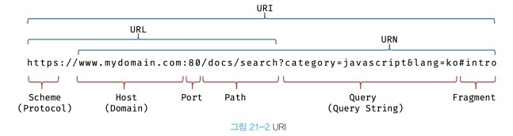

# 21 빌트인 객체

## 21.1 자바스크립트 객체의 분류

1. 표준 빌트인 객체(strandard built-in objects/native objects/global objects)

- 애플리케이션의 공통 기능을 제공한다.
- 실행환경에 상관과 관계없이 언제나 사용할 수 있다.

2. 호스트 객체(host objects)

- 자바스크립트 실행 환경(브라우저/Node.js)에서 추가로 제공하는 객체를 말한다.
- 클라이언트 사이트 Web API, Node.js 고유의 API

3. 사용자 정의 객체(user-defined objects)

### 표준 빌트인 객체

생성자 함수 객체인 표준 빌트인 객체는 프로토타입 메서드와 정적 메서드를 제공하고, 생정자 함수 객체가 아닌 표준 빌트인 객체는 정적 메서드만 제공한다.

### 원시값과 래퍼 객체

원시값을 객체 처럼 사용하면 자바스크립트 엔진은 암묵적으로 연관된 객체를 생성하여 생성된 객체로 프로퍼티에 접근하거나 메서드를 호출하고 다시 원시값으로 되돌린다.

래퍼 객체의 처리가 종료되면 래퍼 객체의 `[[StringData]]` 내부 슬롯에 할당된 원시값으로 되돌리고 래퍼 객체는 가비지 컬렉션의 대상이된다.

래퍼객체를 통해 원시값도 객체처럼 사용 가능하다. 따라서 원시값은 new 키워드와 생성자 함수를 통해 생성할 필요가 없다.

null, undefined는 래퍼 객체를 생성하지 않는다. 따라서 객체 처럼 사용하면 에러가 발생한다.

## 21.4 전역 객체

globalThis: (ES11) 전역 객체를 지칭하는 다양한 이름을 통칭 한다.

```js
// 브라우저 환경
globalThis === this; // true
globalThis === window; // true
globalThis === self; // true
globalThis === frames; // true

// Node.js (12.0.0 이상)
globalThis === this; // true
globalThis === global; // true
```

전역 객체는 표준 빌트인 객체와 호스트 객체, 그리고 var 키워드로 선언한 전역 변수와 전역 함수를 프로퍼티로 갖는다.

전역 객체 특징

- 전역 객체는 개발자가 의도적으로 생성할 수 없다. (전역 객체를 생성할 수 있는 생성자 함수가 제공되지 않는다.)
- 전역 객체의 프로퍼티를 참조할 때 window(또는 global)를 생략할 수 있다.
- 전역 객체는 표준 빌트인 객체를 프로퍼티로 가지고 있다.
- 자바스크립트 실행 환경에 따라 추가적으로 프로퍼티와 메서드를 갖는다. (클라이언트 사이드 Web API, Node.js 고유의 API)
- var 키워드로 선언한 전역 변수와 선언하지 않은 변수에 값을 할당한 암묵적 전역, 그리고 전역 함수는 전역 객체의 프로퍼티가 된다.
- let, const 키워드로 선언한 전역 변수는 전역 객체의 프로퍼티가 아니다. 보이지 않는 개념적인 블록(전역 렉시컬 환경의 선언적 환경 레코드) 내에 존재하게 된다
- 브라우저 환경의 모든 자바스크립트 코드는 하나의 전역 객체 window를 공유한다.

### 빌트인 전역 프로퍼티

```js
// 1. Infinity
console.log(window.Infinity === Infinity); // true
console.log(3 / 0); // Infinity
console.log(-3 / 0); // -Infinity
console.log(typeof Infinity); // number

// 2. NaN
console.log(window.NaN); // NaN
console.log(Number("xyz")); // NaN
console.log(1 * "string"); // NaN
console.log(typeof NaN); // number

// 3. undefiend
// undefined 프로퍼티는 원시 타입 undefiend를 값으로 갖는다
console.log(window.undefined); // undefined
var foo;
console.log(foo); // undefined
console.log(typeof undefined); // undefined
```

### 빌트인 전역 함수

#### 1. eval

- 자바스크립트 코드를 나타내는 문자열을 인수로 받아
- 표현식이면 문자열 코드를 평가하여 값을 생성하고
- 문이면 문자열 코드를 런타임에 실행한다.

```js
// 표현식인 문
eval("1 + 2;"); // 3
// 표현식이 아닌 문
eval("var x = 5;"); // undefiend

// eval 함수에 의해 런타임에 변수 선언문이 실행되어 x 변수가 선언되었다.
console.log(x); // 5

// 객체 리터럴은 반드시 괄호로 둘러싼다.
const o = eval("({a: 1})");
console.log(o); // {a: 1}

// 함수 리터럴은 반드시 괄호로 둘러싼다.
const f = eval("(function(){ return 1; })");
console.log(f()); // 1

// 전달받은 문자열 코드가 어려 개의 문으로 이루어져 있다면
// 모든 문을 실행하고 마지막 결과값을 반환한다.
eval("1 + 2; 3 + 4;"); // 7
```

eval 함수는 자신이 호출된 위치에 해당하는 기존의 스코프를 런타임에 동적으로 수정한다.

```js
const x = 1;
function foo() {
  // eval 함수는 런타임에 foo 함수의 스코프를 동적으로 수정한다.
  eval("var x = 2;");
  console.log(x);
}

foo(); // 2
console.log(x); // 1
```

strict mode 에서는 eval 함수는 기존의 스코프를 수정하고 않고 eval 함수 자신의 자체적인 스코프를 생성한다.

```js
const x = 1;
function foo() {
  "use strict";
  eval("var x = 2; console.log(x);"); // 2
  console.log(x); // 1
}

foo(); // 2 1
console.log(x); // 1
```

인수로 전달받은 문자열 코드가 let, const 키워드를 상요한 변수 선언문이라면 암묵적으로 strict mode가 적용된다.

eval 함수는 사용자의 입력으로부터 받은 코드를 그대로 실행하기 때문에 보안에 취약하며, 자바스크립트 엔진에 의해 최적화가 되지 않으므로 처리 속도가 느리다.

**eval 함수의 사용은 금지해야한다.**

#### 2. isFinite

전달받은 인수를 숫자 타입으로 변환한 후 유한수이면 true를 반환한다. 무한수이거나 NaN으로 평가되는 값이라면 false를 반환한다.

```js
/**
 * @param {number} testValue - 검사 대상 값
 * @returns {boolean} 유한수 여부 확인 결과
 */
isFinite(testValue);
```

#### 3. isNaN

전달받은 인수를 숫자 타입으로 변환한 후 NaN 이면 true를 반환한다.

```js
/**
 * @param {number} testValue - 검사 대상 값
 * @returns {boolean} 유한수 여부 확인 결과
 */
isNaN(testValue);
```

#### 4. parseFloat

전달받은 문자열 인수를 부동 소수점 숫자(Floating point number), 실수로 해석하여 반환한다.

```js
/**
 * @param {string} string - 변환 대상 값
 * @returns {number} 변환 결과
 */
parseFloat(string);
```

#### 5. parseInt

전달받은 문자열 인수를 정수(integer)로 해석하여 반환한다.

기수를 지정하면 첫 번째 인수로 전달된 문자열을 해당 기수의 숫자로 해석하여 10진수 정수로 반환한다.

```js
/**
 * @param {string} string - 변환 대상 값
 * @param {number} [radix] - 진법은 타내는 기수(2-36, 기본값 10)
 * @returns {number} 변환 결과
 */
parseInt(string, radix);
```

#### 5. encodeURI / decodeURI

encodeURI 함수는 완전한 URI(Uniform Resource Identifier)를 문자열로 전달받아 이스케이프 처리를 위해 인코딩한다.



URI

- 인터넷에 있는 자원을 나타내는 유일한 주소
- URI: Scheme(Protocol) + Host(Domain) + Port + Path + Query + Fragment
  - URL + Query + Fragment
  - Scheme + URN
- URL: Scheme(Protocol) + Host(Domain) + Port + Path
- URN: Host(Domain) + Port + Path + Query + Fragment

encodeURI

```js
/**
 * @param {string} uri - 완전한 URI
 * @returns {string} 인코딩된 URI
 */
encodeURI(uri);
```

decodeURI

```js
/**
 * @param {string} encodedURI - 인코딩된 URI
 * @returns {string} 디코딩된 URI
 */
decodeURI(encodedURI);
```

인코딩

- URI의 문자들을 이스케이프 처리하는 것
- 어떤 시스템에서도 읽일 수 있는 아스키 문자 셋으로 변환하는 것

```js
// 완전한 URI
const uri = "http://example.com?name=이웅모&job=programmer&teacher";

// encodeURI 함수는 완전한 URI를 전달받아 이스케이프 처리를 위해 인코딩한다.
const enc = encodeURI(uri);
console.log(enc);
// http://example.com?name=%EC%9D%B4%EC%9B%85%EB%AA%A8&job=programmer&teacher

const dec = decodeURI(enc);
console.log(dec);
// http://example.com?name=이웅모&job=programmer&teacher
```

encodeURIComponent / decodeURIComponent

URI 구성 요소를 대상으로 인코딩/디코딩 한다. 전달된 문자열을 URI의 구성요소인 쿼리스트링의 일부로 간주하고 =, ?, &까지는 인코딩한다.

반면 encodeURI 함수는 전달된 문자열을 완전한 URI 전체라고 간주하고, =, ?, &은 인코딩하지 않는다.

```js
const uriComp = "name=이웅모&job=programmer&teacher";

let enc = encodeURIComponent(uriComp);
console.log(enc);
// encodeURIComponent 함수는 인수로 전달받은 문자열을 URI의 구성요소인 쿼리 스트링의 일부로 간주한다.
// 쿼리스트링 구분자 (=, ?, &) 까지 인코딩 한다.
// name%3D%EC%9D%B4%EC%9B%85%EB%AA%A8%26job%3Dprogrammer%26teacher

let dec = decodeURIComponent(enc);
console.log(dec);
// name=이웅모&job=programmer&teacher

enc = encodeURI(uriComp);
console.log(enc);
// encodeURI 함수는 인수로 전달받은 문자열을 완전한 URI로 간주한다.
// 쿼리스트링 구분자 (=, ?, &) 는 인코딩 하지 않는다.
// name=%EC%9D%B4%EC%9B%85%EB%AA%A8&job=programmer&teacher

dec = decodeURI(enc);
console.log(dec);
// name=이웅모&job=programmer&teacher
```

### 암묵적 전역 (implicit global)

선언하지 않은 식별자에 값을 할당하면 전역 객체의 프로퍼티가 된다.

```js
y = 20;
// window.y = 20;
```

변수 y를 스코프 체인을 따라 선언된 변수 인지 확인하고, 변수의 선언을 찾을 수 없으면 전역 객체의 프로퍼티로 동적 생성한다. y는 변수로 선언된 것이 아니라 전역 객체의 프로포티로 추가 되었을 뿐이므로 변수 호이스팅이 일어나지 않는다.

```js
// 전역 변수 x는 호이스팅이 발생하낟.
console.log(x); // undefiend (변수 x는 메모리에 할당 된후 초기화 되었다.)
// 전역 변수가 아니라 단지 전역 객체의 프로퍼티 y는 호이스팅이 발생하지 않는다.
console.log(y); // ReferenceError: y is not defined

var x = 10; // 전역 변수

function foo() {
  // 선언하지 않은 식별자에 값을 할당
  y = 20; // window.y = 20;
}
foo();

// 선언하지 않은 식별자 y를 전역에서 참조할 수 있다.
console.log(x + y); // 30
```

전역변수는 delete 연산자로 삭제할 수 없지만, 전역 객체의 프로퍼티는 delete 연산자로 삭제를 할 수 있다.

```js
console.log(window.x); // 10
console.log(window.y); // 20

delete x; // 전역 변수는 삭제되지 않는다.
delete y; // 프로퍼티는 삭제된다.

console.log(window.x); // 10
console.log(window.y); // undefined
```
